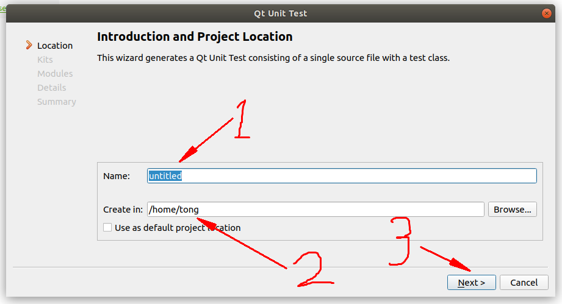
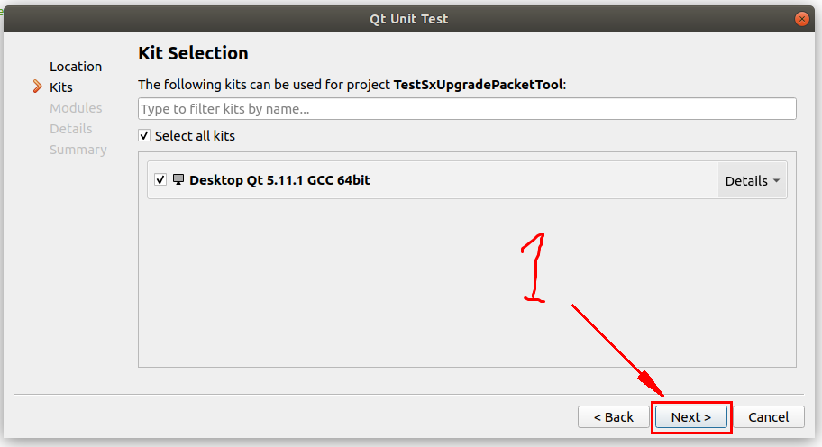
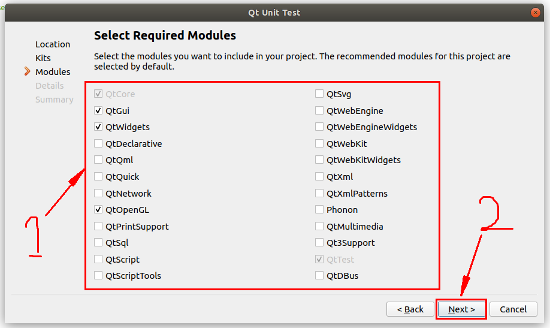
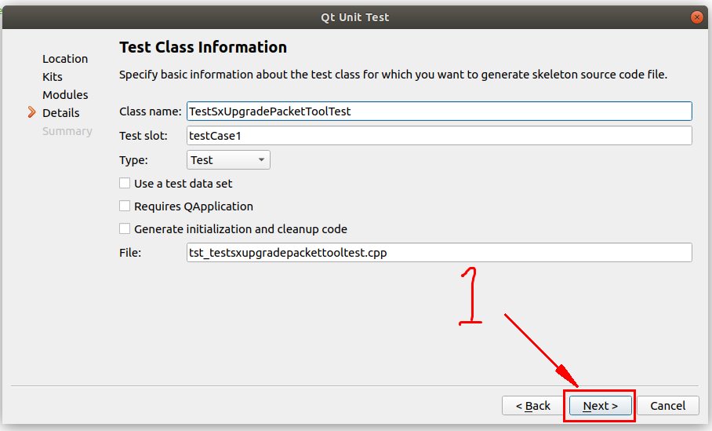

# 使用Qt进行单元测试

## 1. 新建一个单元测试工程

### 通过QtCreator来创建一个测试工程

1. 选择工程类型


按照图示步骤新建一个Qt Unit Test工程文件，最后点击Choose

2. 填写单元测试工程的名称和路径



3. 选择需要的编译器（可以选择默认)



4. 选择用到的模块



5. 配置工程模板



通过以上5步既可以完成一个QTest工程的新建。


Qt单元测试的工程模板较为简单，如下所示：

```
#include <QString>
#include <QtTest>    // #1

class TestSxUpgradePacketToolTest : public QObject    // #2
{
    Q_OBJECT

public:
    TestSxUpgradePacketToolTest();

private Q_SLOTS:    // #3
    void testCase1();    // #4
};

TestSxUpgradePacketToolTest::TestSxUpgradePacketToolTest()
{
}

void TestSxUpgradePacketToolTest::testCase1()
{
    QVERIFY2(true, "Failure");    // #5
}

QTEST_APPLESS_MAIN(TestSxUpgradePacketToolTest)    // #6

#include "tst_testsxupgradepackettooltest.moc"
```


以上代码是QTest的最简单的代码工程，其中有6行需要注意。

> #1. Qt单元测试工程需要包含<QtTest>头文件

> #2. Qt单元测试类需要继承QObject

> #3. 测试函数应声明为 private Q_SLOTS，否则Qt无法找到测试函数，也就无法进行测试

> #4. 这是一个测试函数，每个被测对象应该单独的写进一个测试函数中

> #5. 这是一个判断宏，它有两个传入参数，第一个参数为布尔类型，第二个参数为字符串，当第一个参数为真的情况下，测试通过，并继续下一个测试；第一个参数为假的情况下将会终止测试，并输出错误信息，和第二个参数的字符串。Qt的测试框架中还有着很多其它的宏来判断程序的运行结果与期望是否相同。

> #6. 这个宏扩展为main函数，与QTEST_MAIN宏类似，但QTEST_APPLESS_MAIN不包含界面测试，因此如果需要进行界面测试可以使用QTEST_MAIN宏取代。


### 一些补充

在进行单元测试的过程中，有一些对象、变量等的初始化和销毁工作，如果在每个测试函数中都写这些代码会显得很麻烦，因此Qt提供了4个函数来解决这个问题，同样，这些函数也必须写在 private Q_SLOTS 之后。

initTestCase() 函数将会在整个测试运行之前执行

```
void initTestCase();
```

cleanupTestCase() 函数将会在整个测试运行结束之后执行

```
    void cleanupTestCase();
```

init() 函数将会在每个测试函数执行之前运行

```
    void init();
```

cleanup() 函数将会在每个测试函数执行之后运行

```
    void cleanup();
```
